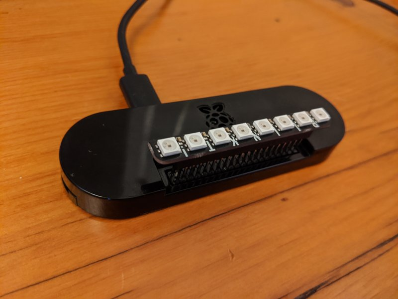

# sleep-timer
A simple raspberry pi zero / pimoroni BLINKT child sleep timer.  This project is a low-cost LED sleep timer to help your child know via programmable LED lights when its OK to get out of bed, sleep, or have some quiet time in the morning without waking anyone up (hopefully).  The Pimoroni BLINKT module is really great because its cheap, easily programable via python, sits right on the pi heaer, and fits in most pi zero cases.

It works like this:
- Between 7:30pm (bedtime) and 6:15am the sleep-timer shows 2 red LEDs, meaning 'stay in bed'.
- From 6:15am to 7:15am the sleep-timer shows 2 yellow LEDs, meaning 'its ok to wake up and play or read quietly in your room'
- At 7:15am the sleep time lights all LEDs green meaning its TIME TO WAKE UP!
- At 9:30am the lights go off during the day



## Hardware requirements
- Raspberry Pi Zero with header (wifi version) (otherwise youll need a real time clock) [link](https://www.adafruit.com/product/3708)
- MicroSD card (8gb or greater)
- Pimoroni BLINKT [link](https://www.adafruit.com/product/3195)
- Pi Zero case (optional)

## OS setup
- Flash and istall latest raspbian from [here](https://www.raspberrypi.org/downloads/raspbian/) to microSD card
- Configure raspbian lite using `sudo raspi-config`
  * change pi password
  * enable SSH (for remote access)
  * configure WIFI
  * configure locale/timezone/keyboard layout
  
- Set static IP (optional)
edit IP configuration file: `sudo nano /etc/dhcpcd.conf` add the following to the bottom of the file (ensure the static IP being set is not already in use on the network).

```
#static IP configuration 

interface eth0
static ip_address=192.168.50.50/24 
static routers=192.168.50.1 
static domain_name_servers=192.168.50.1
```
 
 ## Software setup
 - Install BLINKT setup script: `curl https://get.pimoroni.com/blinkt | bash`
 - Clone this git repo: `git clone https://github.com/marsmith/sleep-timer`
 - Adjust time interval settings as desired in timer.py script: `nano /sleep-timer/timer.py`
 - Add script to CRON and set to run every 5 minutes: `crontab -e` and add the following line:
 
 ```
 */5 * * * * python /home/pi/sleep-timer/timer.py
 ```
